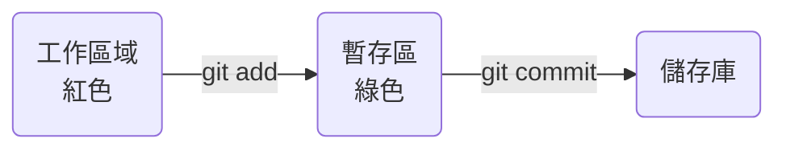

# Git 版本控制

## 指令

```bash
#初始化
git init

# 設定姓名email
git config --global user.name Your Name
git config --global user.email Your email

# 查詢設定檔
git config --list

# 加入暫存
git add .

# 查看狀態
git status

# 提交
git commit -m "訊息"

# 查看版本紀錄
git log
git log --oneline

# 查看完整版本紀錄
git reflog

# 回復
git reset 版本號 --hard

# 連線至遠端
git remote add origin 連線位置

# 推送至遠端
git push origin master
git push origin master -u

# 加上-u可以設定成主串流，下次就可以使用git push上傳即可
git push

# 提取資料（遠端檔案較新時）
git pull origin master

#如果push時有使用-u，則可以使用git pull
git pull

# 下載資料（本地端沒有檔案）
git clone 路徑

```

<!-- 工作區域(紅色) ==(add)=> 暫存區(綠色) => 儲存庫 -->

